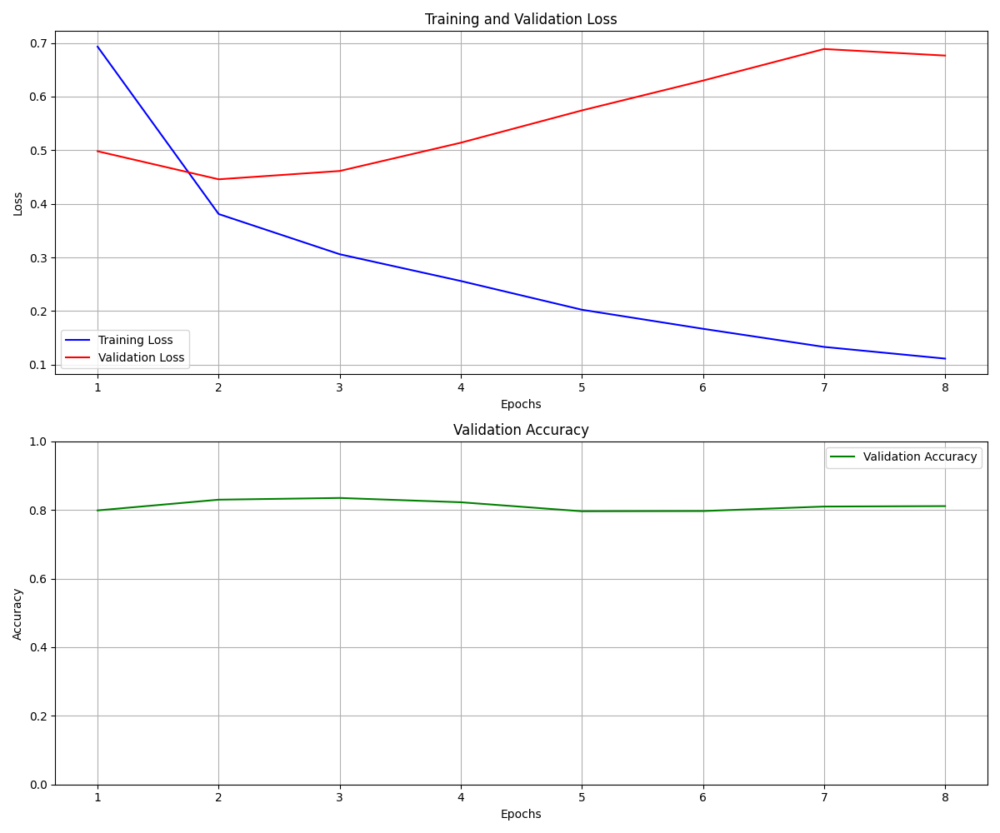

# **医疗Query语义匹配系统**


## 项目介绍

本项目是一个基于深度学习的医疗Query语义匹配系统，旨在对医学查询对进行相关性分类。系统能够判断两个医疗查询之间的语义关系，并将其分为3类：

- **2分**：主题等价，表述一致
- **1分**：语义子集关系
- **0分**：语义父集或毫无关联

该系统基于 RoBERTa-large 预训练模型，结合早停机制和训练可视化技术，在医疗文本匹配任务上实现了高效训练和精准预测。


==本次项目源于：[天池大赛](https://tianchi.aliyun.com/competition/gameList/activeList)>[日常学习赛](https://tianchi.aliyun.com/competition/getstartList)>[【NLP】医学搜索Query相关性判断](https://tianchi.aliyun.com/competition/entrance/532001)==


## 数据集说明

本数据集来自中文医疗信息评测基准 [CBLUE](https://tianchi.aliyun.com/cblue) , 本学习赛中的 KUAKE-QQR 数据集任务可以看作是判断两个输入句子的语义相似度，CBLUE 还包括了 CHIP-STS（2分类，难度低于本学习赛） 和 KUAKE-QTR（4分类，难度高于本学习赛） 两个同质任务，感兴趣的同学可以在 CBLUE 评测基准上完成其他两个同质任务进行巩固实践。项目的数据集 json 文件包含三个部分：

### 数据格式

```json
[
  {
    "id": "s1",
    "query1": "天价输液费",
    "query2": "输液价格",
    "label": "0"
  },
  ...
]
```

### 数据集划分

| 数据集 | 文件路径                                           | 样本数量 |
| :----- | :------------------------------------------------- | :------- |
| 训练集 | `./data/query-classification/KUAKE-QQR_train.json` | 6,938    |
| 验证集 | `./data/query-classification/KUAKE-QQR_dev.json`   | 2,312    |
| 测试集 | `./data/query-classification/KUAKE-QQR_test.json`  | 2,312    |

### 分类标准

| 分数 | 关系类型       | 示例                                                     |
| :--- | :------------- | :------------------------------------------------------- |
| 2    | 主题等价       | "小孩子打呼噜是什么原因引起的" vs "小孩子打呼噜什么原因" |
| 1    | 语义子集       | "双眼皮遗传规律" vs "内双眼皮遗传"                       |
| 0    | 语义父集或无关 | "脑梗最怕的四种食物" vs "脑梗患者吃什么好"               |


## 文件夹格式

```makefile
Query_Classification/
├───data/                         # 数据目录
    ├───KUAKE-QQR_dev.json        # 验证集数据
    ├───KUAKE-QQR_test.json       # 测试集数据
    ├───KUAKE-QQR_train.json      # 训练集数据
    ├───README-data.md
    ├───example_pred.json         # 预测结果示例
    └───images/                   # data图片目录
└───output/                       # 输出目录
    ├───log/                      # 日志目录
    ├───model/                    # 模型目录
    └───pic/                      # 图片输出目录
├───README.md                     
├───requirements.txt               
├───train.py                      # 主训练脚本
├───【NLP】医学搜索Query相关性判断_学习赛_天池大赛-阿里云天池的赛制.pdf
```


## 模型架构实现

### 核心架构


1. **预训练模型**：
   - 使用<kbd>`hfl/chinese-roberta-wwm-ext-large`</kbd>中文预训练模型
   - 模型参数：1024 隐藏层大小，24 层 Transformer，330M 参数
   - 输入处理：最大长度 256，动态填充与截断

2. **微调架构**：

```python
model = BertForSequenceClassification.from_pretrained(
    'hfl/chinese-roberta-wwm-ext-large',
    num_labels=3  # 三分类任务
)
```


3. **优化策略**：

- 优化器：AdamW (*lr=2e-5*, *eps=1e-8*)
- 学习率调度：带 warmup 的 **线性衰减**

```python
scheduler = get_linear_schedule_with_warmup(
    optimizer,
    num_warmup_steps=int(0.1 * total_steps),
    num_training_steps=total_steps
)
```


4. **早停机制**：

- 耐心值(*patience*)：5 个epoch
- 最小提升(*min_delta*)：0.001
- 保存验证集最佳模型


## 快速开始

### 环境要求：安装依赖

```bash
pip install -r requirements.txt
```

### 训练模型

```python
# 配置参数
MODEL_NAME = 'hfl/chinese-roberta-wwm-ext-large'
MAX_LEN = 256
BATCH_SIZE = 24
EPOCHS = 30
LEARNING_RATE = 2e-5

# 运行主程序
if __name__ == '__main__':
    main()
```

### 完整流程

1. 数据准备：确保数据集放在正确路径
2. 模型训练：执行<kbd>`main()`</kbd>函数
3. 结果查看：
   - 最佳模型：<kbd>`./best_medical_query_model.bin`</kbd>
   - 训练历史：<kbd>./training_history/`</kbd>
   - 测试预测：<kbd>./KUAKE-QQR_test_pred.json`</kbd>

## 结果展示

### 训练历史可视化




### 性能指标

| epoch | train_loss | val_loss | val_acc |
| :---: | :--------: | :------: | :-----: |
|   1   |   0.6930   |  0.4980  | 0.7988  |
|   2   |   0.3809   |  0.4457  | 0.8300  |
|   3   |   0.3059   |  0.4612  | 0.8350  |
|   4   |   0.2560   |  0.5139  | 0.8225  |
|   5   |   0.2025   |  0.5742  | 0.7963  |
|   6   |   0.1667   |  0.6298  | 0.7969  |
|   7   |   0.1331   |  0.6887  | 0.8100  |
|   8   |   0.1113   |  0.6765  | 0.8113  |

战绩可查  ∠( ᐛ 」∠)_：


