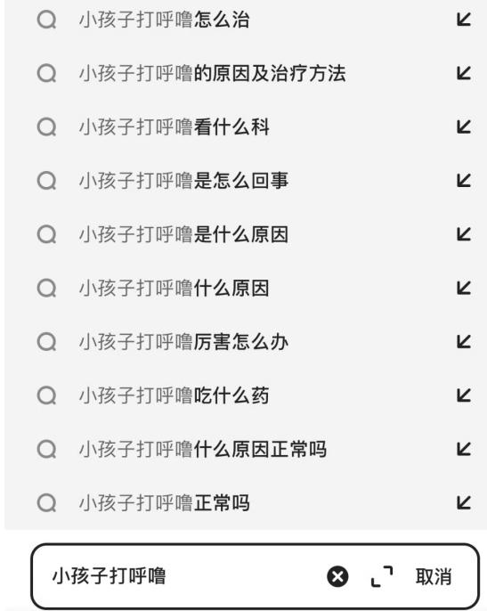

# 【NLP】医学搜索Query相关性判断

# 赛制

# 赛题与数据

<table><tr><td>排行榜</td><td>文档</td><td>大小</td><td>操作</td><td>ossutil命令</td></tr><tr><td>光荣榜</td><td>example_pred.json</td><td>json(205KB)</td><td>下载</td><td>复制命令</td></tr><tr><td>论坛</td><td>KUAKE-QQR_dev.json</td><td>json(205KB)</td><td>下载</td><td>复制命令</td></tr><tr><td>使用天池实验室打比赛</td><td>KUAKE-QQR_test.json</td><td>json(204KB)</td><td>下载</td><td>复制命令</td></tr><tr><td>提交结果</td><td>KUAKE-QQR_train.json</td><td>json(1MB)</td><td>下载</td><td>复制命令</td></table>

# 赛题描述

赛题描述Query（即搜索词）之间的相关性是评估两个Query所表述主题的匹配程度，即判断Query- A和Query- B是否发生转义，以及转义的程度。Q是指query的专注点，判定两个查询词之间的相关性是一项重要的任务，常用于长尾query的搜索质量优化场景，本任务数据集就是在这样省生的。数据集来源于中文医疗信息评测基准CBLUE，由阿里巴巴夸克医疗事业部提供。

图1：阿里夸克App搜索示意图，搜索query为“小孩子打呼噜”



# 赛题说明

Query和Title的相关度共分为3档（0- 2），0分为相关性最差，2分表示相关性最好。

- 2分：表示A与B等价，表述完全一致- 1分：B为A的语义子集，B指代范围小于A- 0分：B为A的语义父集，B指代范围大于A；或者A与B语义毫无关联

医学检索词相关性示例如下：

# 2分

Query- A和Query- B主题等价，表述一致；

<table><tr><td>Query-A</td><td>Query-B</td><td>解释</td></tr><tr><td>小孩子打呼噜是什么原因引起的</td><td>小孩子打呼噜什么原因</td><td></td></tr><tr><td>双眼皮怎么遗传</td><td>双眼皮遗传规律</td><td></td></tr><tr><td>黄体</td><td>女性黄体</td><td></td></tr><tr><td>点痣</td><td>点痣祛痣</td><td></td></tr></table>

# 1分

B为A的语义子集，B指代范围小于A

<table><tr><td>Query-A</td><td>Query-B</td><td>解释</td></tr><tr><td>双眼皮遗传规律</td><td>内双眼皮遗传</td><td></td></tr><tr><td>尿酸高手脚酸痛</td><td>尿酸高 脚疼</td><td></td></tr><tr><td>海绵状血管瘤</td><td>多发性海绵状血管瘤</td><td></td></tr><tr><td>足藓</td><td>足藓如何治疗</td><td></td></tr><tr><td>室管膜囊肿与蛛网膜</td><td>左侧极蛛网膜囊肿</td><td>室管膜囊肿与蛛网膜为不同部位，但B为蛛网膜的一部分，子集。</td></tr><tr><td>板蓝根</td><td>好医生板蓝根</td><td></td></tr><tr><td>怀孕血糖高对胎儿有什么影响</td><td>怀孕初期血糖高对胎儿的影响</td><td></td></tr><tr><td>什么感冒药效果好</td><td>什么感冒药起效快</td><td>效果好有程度及快慢之分，故B为子集</td></tr><tr><td>搭桥手术和支架的区别</td><td>什么是支架和搭桥</td><td>A表述：搭桥的概念，支架的概念，二者的区别。B表述：搭桥的概念，3述了A的一部分，故子集。</td></tr></table>

# 0分

第一种情况：B为A的语义父集，B指代范围大于A；

第二种情况：A与B语义毫无关联  

<table><tr><td>Query-A</td><td>Query-B</td><td>解释</td></tr><tr><td>双眼皮遗传规律</td><td>单眼皮与双眼皮遗传</td><td></td></tr><tr><td>小孩子打呼噜什么原因</td><td>孩子打呼噜</td><td></td></tr><tr><td>牛蒡可以煮着吃</td><td>牛蒡如何吃</td><td></td></tr><tr><td>死了的大闸蟹能吃吗</td><td>死了的螃蟹能吃么</td><td></td></tr><tr><td>拔智齿后悔死了</td><td>拔了智齿</td><td>B是A必要前提条件，没有B的发生就没有A</td></tr><tr><td>光子嫩肤后注意事项</td><td>光子嫩肤的注意事项</td><td></td></tr><tr><td>白血病血常规有啥异常</td><td>白血病血检有哪些异常</td><td></td></tr></table>

<table><tr><td>Query-A</td><td>Query-B</td><td>解释</td></tr><tr><td>脑梗最怕的四种食物</td><td>脑梗患者吃什么好</td><td></td></tr><tr><td>牛蒡可以煮着吃</td><td>牛蒡有副作用吗</td><td></td></tr><tr><td>天津肿瘤医院官网</td><td>北京市肿瘤医院官网</td><td></td></tr><tr><td>二甲双胍副作用是啥</td><td>二甲双胍有副作用吗</td><td></td></tr><tr><td>麻腮风两针间隔时间</td><td>麻腮风接种时间</td><td></td></tr><tr><td>排卵前出血</td><td>排卵前期出血</td><td>A为排卵未开始，B为排卵刚开始时</td></tr><tr><td>石榴上火么</td><td>吃番石榴上火吗</td><td>石榴与番石榴为不同水果，易混淆</td></tr></table>

# 评测数据

本评测开放训练集数据15000条，验证集数据1600条，测试集数据1596条。下载文件名为KUAKE- QQR.zip，包括：

- KUAKE-QQR_train.json：训练集- KUAKE-QQR_dev.json：验证集- KUAKE-QQR_test.json：测试集，选手提交的时候需要为每条记录增加"label"字段- example_pred.json：提交结果示例

# 数据格式

# 数据以json格式提供：

```json
# 训练集（KUAKE-QQR_train.json）/验证集（KUAKE-QQR_dev.json）的格式为：

[
  {
    "id": "s1",               # 记录id 
    "query1": "天价输液费",     # Query-1
    "query2": "输液价格",      # Query-2
    "label": "0"              # 相关性得分
  },
  {
    "id": "s2",
    "query1": "天价输液费",
    "query2": "输液港费用",
    "label": "0"
  },
  ...
]

# 测试集（KUAKE-QQR_test.json）的格式为：
[
  {
    "id": "s31",               # 记录id
    "query1": "患腱鞘炎",       # query-1
    "query2": "腱鞘炎怎么得的",  # query-2
    "label": ""                # 需预测标签，默认都是空字符串
  },
  {
    "id": "s32",
    "query1": "患腱鞘炎",
    "query2": "腱鞘炎严重",
    "label": ""
  },
  ...
]
```


# json文件读写示例

选手可以参照如下代码进行json数据的读写：

```python
import json

# 读json文件（以训练集为例）：
with open('KUAKE-QQR_train.json') as input_data:
    json_content = json.load(input_data)
    # 逐条读取记录
    for block in json_content:
        record_id = block['id']
        query1 = block['query1']
        query2 = block['query2']
        label = block['label']
        
# 写json文件，本示例代码从测试集KUAKE-QQR_test.json读取数据数据，将预测后的数据写入到KUAKE-QQR_test_pred.json：
with open('KUAKE-QQR_test.json') as input_data, open('KUAKE-QQR_test_pred.json', 'w') as output_data:
    json_content = json.load(input_data)
    # 逐条读取记录，并将预测好的label赋值
    for block in json_content:
        query1 = block['query1']
        query2 = block['query2']
        # 此处调用自己的模型来预测当前记录的label，仅做示例用：
        block['label'] = your_model.predict(query1, query2)
    # 写json文件
    json.dump(json_content, output_data, indent=2, ensure_ascii=False)
```

# 评估标准

本任务的评价指标使用准确率Accuracy来评估，即：准确率（Accuracy）  $=$  #预测正确的条目数/#预测总条目数

# 如何提交

选手需要提交KUAKE- QOR_test.json文件，并为KUAKE- QOR_test.json中每条记录预测"label"字段（默认是空字符串），提交样例可参照example_pred.json。

# 赛题及baseline解读视频：

https://tianchi.aliyun.com/course/1160 Part1- 赛题介绍 Part2- 建模思路 Part3- 方法介绍

# 引用

如果您在研究/工作中使用到了本数据集，请引用如下工作：

@inproceedings(zhang- etal- 2022- cblue, title  $=$  "CBLUE):A{cjhinese Biomedical Language Understanding Evaluation Benchmark", author  $=$  "zhang,Ningyu and Chen,Mosha and B1,Zhen and Liang,Xiaozhuan and Li,Lei and Shang,xin and Yin,Kang bookttle "Proceedings of the 60th Annual Meeting of the Association for Computational Linguistics (Volume 1: Lc month  $=$  max", year  $=$  "2022", address  $=$  "Dublin,Ireland", publisher  $=$  "Association for Computational Linguistics", url  $=$  "https://aclanthology.org/2022. acl- long.544", pages  $=$  "7888- - 7915"

# 更进一步

本数据集来自中文医疗信息评测基准CBLUE，本学习赛中的KUAKE- QQR数据集任务可以看作是判断两个输入句子的语义相似度，CBLUE:CHIP- STS（2分类，难度低于本学习赛）和KUAKE- QTR（4分类，难度高于本学习赛）两个同质任务，感兴趣的选手可以在CBLUE评演成其他两个同质任务进行巩固实践。

